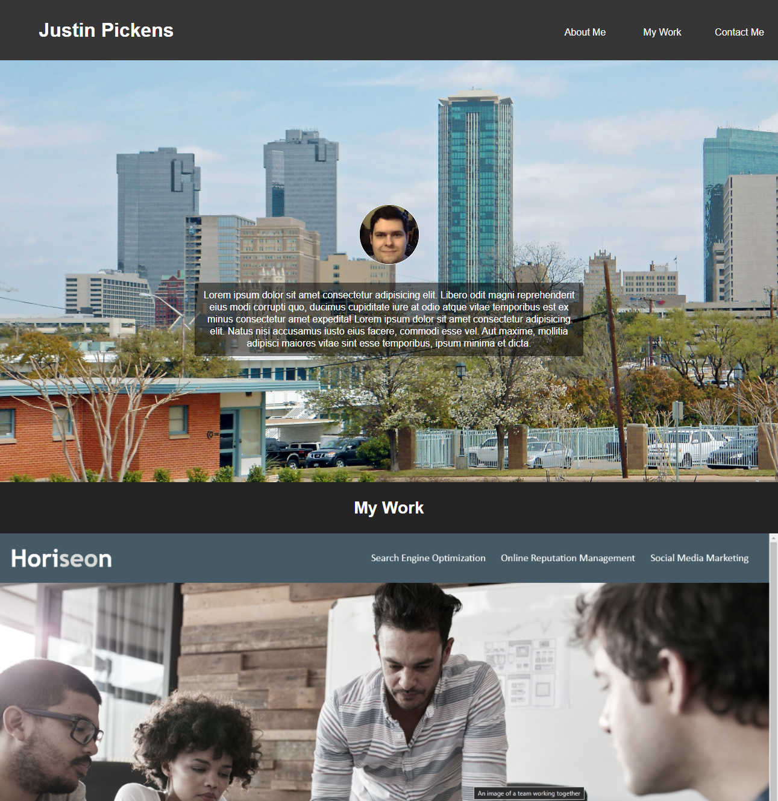

# Portfolio Site

## Description
I started building this site to showcase the projects I've completed. I wanted a nice responsive design for the site, so I opted for a vertical layout that fits the screen. One of the most challenging elements to responsively style was the nav bar. The background images for the cards were tricky too, but I was able to quickly find useful CSS properties (all from w3schools) to format them.

## Link
[Click here to see the finished site.](https://jcpickens0215.github.io/Portfolio-Site/)

## Screenshot
